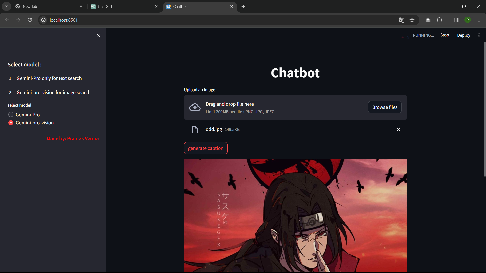

# Chatbot with gemini
 Welcome to the Chatbot with Gemini project! This interactive chatbot leverages the power of the Gemini project for both text and image-based searches. The project uses Streamlit for the user interface, making it easy to deploy and interact with the chatbot.

# Features
 Gemini Models:
-  Gemini-Pro: Ideal for text-based searches.
 - Gemini-pro-vision: Incorporates image search capabilities.
  
 
- User-Friendly Interface: The chatbot comes with a clean and interactive Streamlit interface.
- History Tracking: The chatbot keeps track of user queries and responses, preventing redundant questions.

# Getting Started
##Prerequisites
- Streamlit: Install Streamlit using pip install streamlit.
- Google Generative AI: Install using pip install google-generativeai.
- Pillow: Install using pip install Pillow.
- IPython: Install using pip install ipython.

## Installation
Clone the repository:

- bash
- Copy code
- git clone 
- Navigate to the project directory:

- bash
- Copy code
- cd gemini-chatbot
- Install dependencies:

- bash
- Copy code
- pip install -r requirements.txt
- Usage
- Run the Streamlit app:

- bash
- Copy code
- streamlit run your_script_name.py
- Select the Gemini model (text or vision) from the sidebar.

- Interact with the chatbot by typing messages or uploading images for caption generation.
- chatbot: https://chatbot-7kumwsxdsgcbcrcip7r45f.streamlit.app/   
# Configuration
- Ensure you have a valid Google API key (GOOGLE_API_KEY) for using the Gemini models. Replace the placeholder in the code with your API key.
- Contributing
- We welcome contributions! If you have ideas for improvements or find issues, please open a GitHub issue or submit a pull request. Check out our contribution guidelines for more details.

# Screenshots

